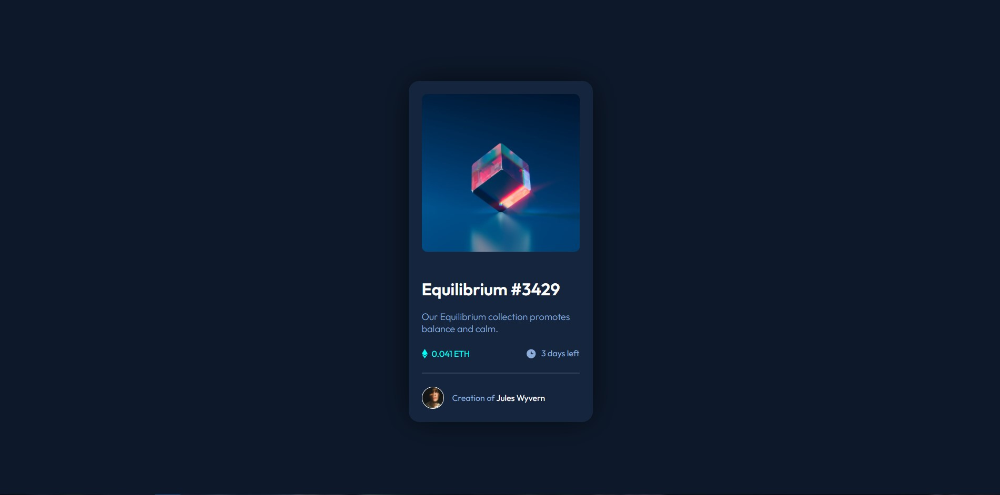

# Frontend Mentor - NFT preview card component solution

This is a solution to the [NFT preview card component challenge on Frontend Mentor](https://www.frontendmentor.io/challenges/nft-preview-card-component-SbdUL_w0U).

## Table of contents

- [Overview](#overview)
  - [The challenge](#the-challenge)
  - [Screenshot](#screenshot)
  - [Links](#links)
- [My process](#my-process)

  - [Built with](#built-with)
  - [What I learned](#what-i-learned)
  - [Useful resources](#useful-resources)

- [Author](#author)
- [Acknowledgments](#acknowledgments)

## Overview

### The challenge

Users should be able to:

- View the optimal layout depending on their device's screen size
- See hover states for interactive elements

### Screenshot

### Links

- Solution URL: 
- Live Site URL: [https://murtorun.github.io/frontendmentor-nft-preview-card](https://murtorun.github.io/frontendmentor-nft-preview-card/)

## My process

### Built with

- Semantic HTML5 markup
- CSS custom properties
- Flexbox

### What I learned

- Using CSS custom properties

- Better understanding of `position: relative` and `position: absolute`

- The most important of all, I learnt that I could do it!

### Useful resources

- [https://rodukao.github.io/NFT-preview-card-exercise](https://rodukao.github.io/NFT-preview-card-exercise/) - It is the live example of a solution (not mine)

## Author

- Website - [Murat Torun](murtorun.github.io)
- Frontend Mentor - [@murTorun](https://www.frontendmentor.io/profile/murTorun)

## Acknowledgments

Thank [@rodukao](https://github.com/rodukao) for sharing the source code of the design. It would be pretty hard for me to do image hovering animation without the source code.
